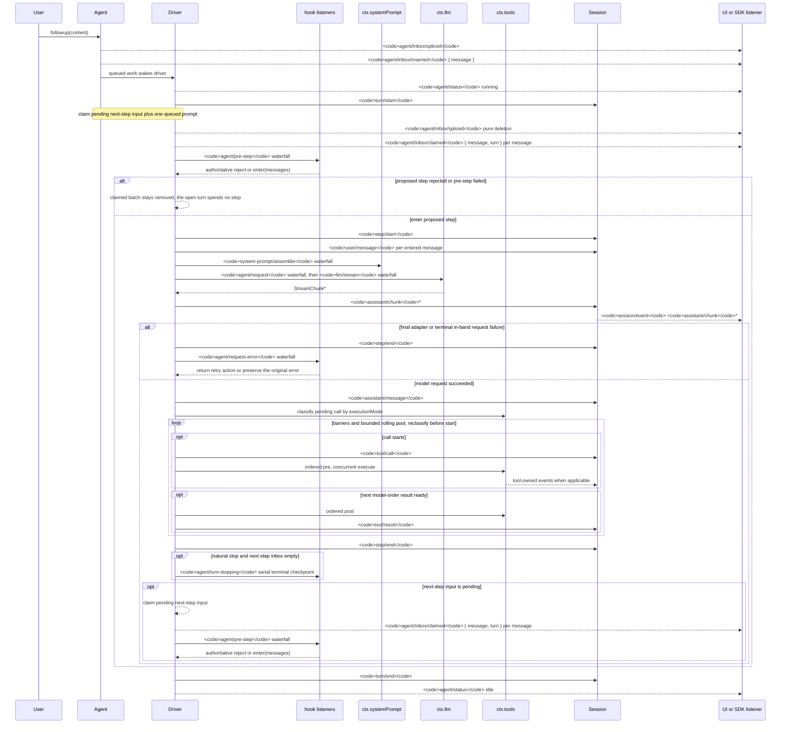

<!-- 由 scripts/gen-doc-graphs.ts 生成——请勿手工编辑。
     运行 `pnpm run gen-doc-graphs` 重新生成。 -->

# Agent 轮次与步骤生命周期

此时序图是 [architecture.md](architecture.zh.md#turn-flow) 的配套图示。持久的回放事实保存在 `session/event` 中，实时控制与状态则保存在 `agent/*` 中。

`assistant/message` 事件记录每一次成功的提供方调用，包括无内容和 `max-tokens` 的结束。空内容不进入派生历史，而持久事件保留用量和 `sourceEventSeqs`，列出确切的 `assistant/chunk` 事件，包括显式的空列表。

`dsh-compaction-basic` 在请求派生之前用 `agent/pre-step` 处理压力，并仅在规范上下文溢出时用 `agent/request-error`。一旦任一触发条件成立，可选的工具结果剪枝会在摘要选择之前运行。恢复在已关闭的失败步与失败轮次关闭之间工作，且仅在剪枝或摘要推进表面替换代数时才开启新的重试轮次；否则原始请求错误保持权威。

返回的 `agent/pre-step` 决策是权威的；包裹 `next()` 的监听者保留下游消息和 `startsRequestSeries`，除非替换是有意的。转向与注入的上下文在后续 claim 操作取走其下一批后，通过同一 waterfall。

需要可回放转录数据的 SDK 用户应消费 `session/event`；`agent/*` 是队列/状态、提示词拦截、请求构造、转向、续行和错误的实时协调 API。

维护模式：人工维护的 Mermaid 时序图，由生成器写出；确切的事件签名位于生成的 Cordis 目录中。。
