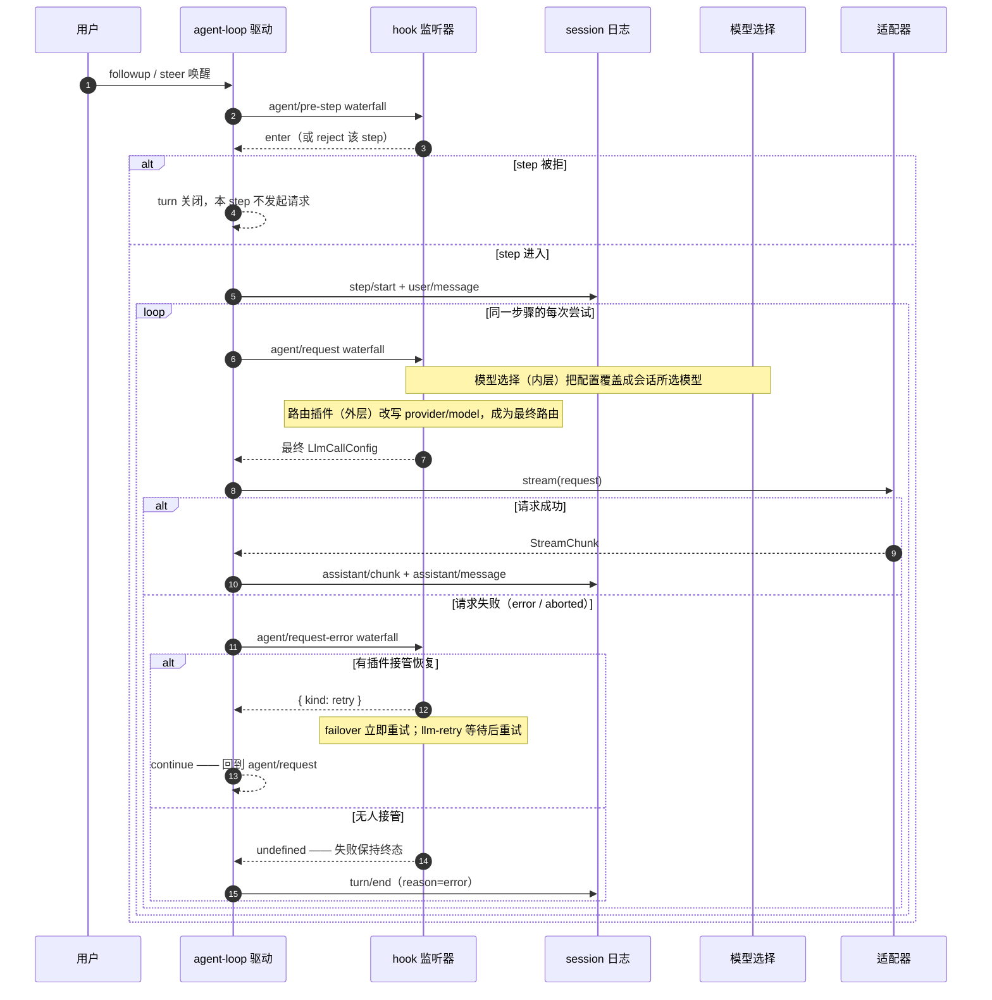
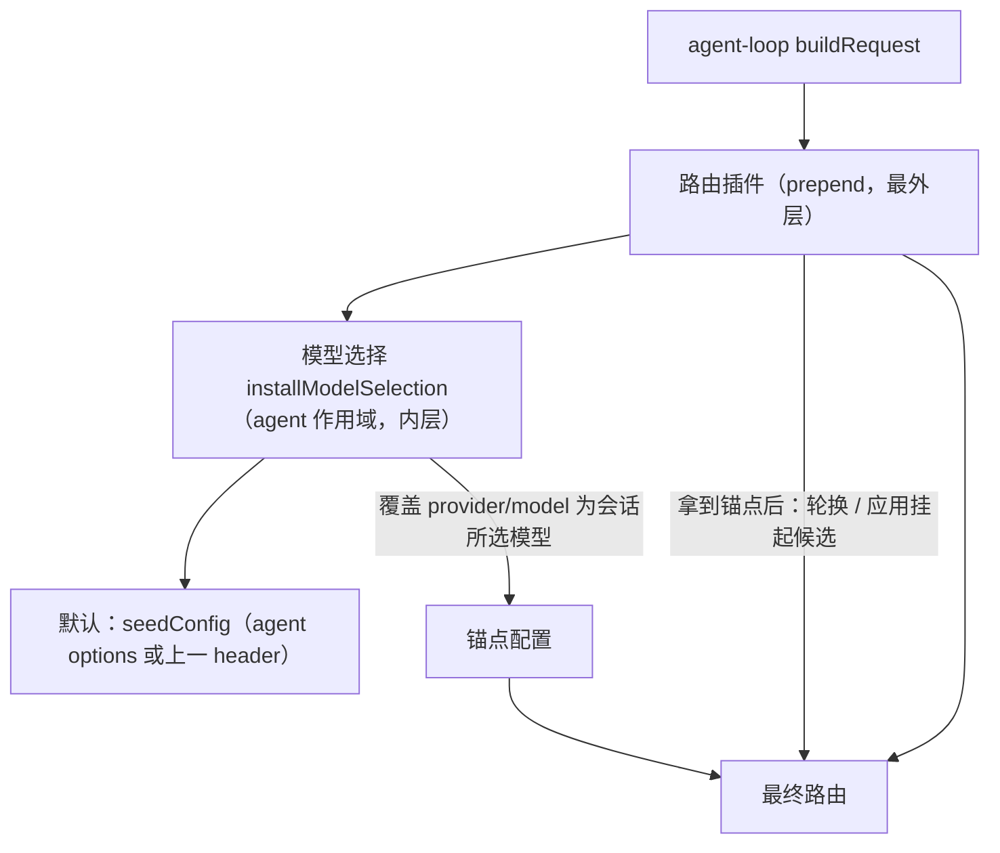
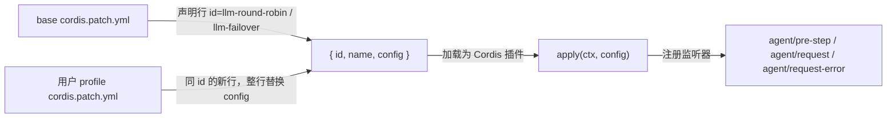
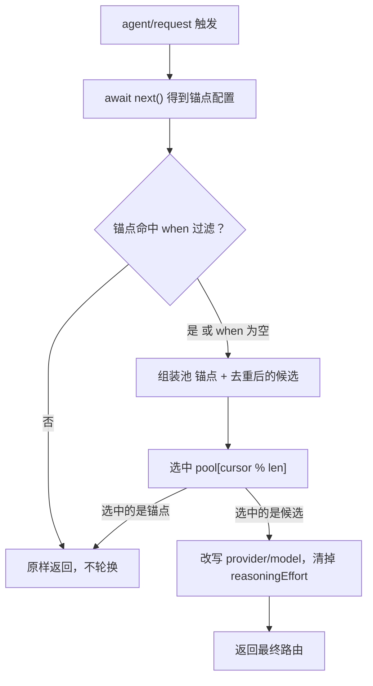
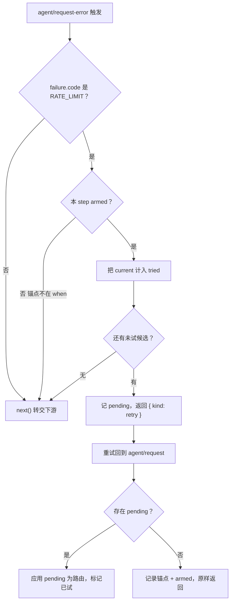
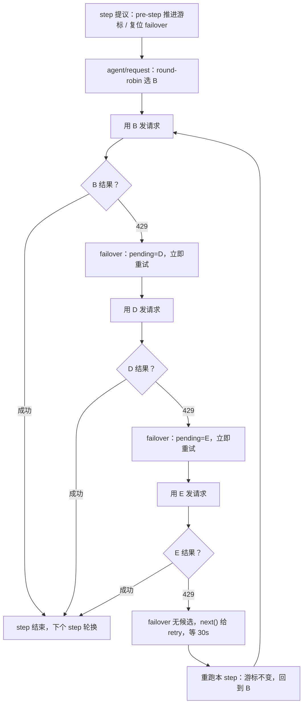

# LLM 模型路由插件：round-robin 与 failover 的运行机制与扩展点

`@deepseek-ai/dsh-llm-round-robin` 与 `@deepseek-ai/dsh-llm-failover` 是两个**模型路由插件**：它们不发起也不重放模型调用，而是挂在 agent-loop 的实时运行事件上，决定"每一次 agent 发起的模型请求最终落在哪个 provider/model 路由"。前者在限流发生前主动把连续请求分摊到多个模型，后者在限流（`RATE_LIMIT`，HTTP 429）发生后把下一次重试立即切到候选模型。两者都只改写请求路由，不改消息与上下文，因此不产生新的会话事件、不改变任何模型可见内容。本文件说明它们依托的运行机制、可用的扩展槽，以及沿请求生命周期的一次完整走查。

机制层面的权威定义在源码与生成目录中：agent 实时事件见 [`packages/core/agent/src/runtime-types.ts`](../../packages/core/agent/src/runtime-types.ts)，事件驱动的循环见 [`packages/core/agent-loop/src/agent.ts`](../../packages/core/agent-loop/src/agent.ts)，包级约定见各自的 [round-robin](../../packages/llm/llm-round-robin/README.zh.md) 与 [failover](../../packages/llm/llm-failover/README.zh.md) README，决策依据见对应的 [Agent Note](../../.agents/notes/implemented/feature/2026-09-08-rate-limit-failover.zh.md)。

## 1. 地基：agent-loop 的 turn、step 与 request

agent-loop 的 `ReactLoopAgent`（[`agent.ts`](../../packages/core/agent-loop/src/agent.ts)）把一个 agent 的运行组织成三层边界：

| 边界 | 含义 | 何时发生 |
|---|---|---|
| turn | 一次用户轮次，从一条唤醒消息开始，到模型不再欠响应（无活动工具调用、无新转向输入）为止 | 每次 `followup`／`steer` 唤醒 |
| step | 一次"模型请求 + 该请求引发的工具执行"单元；工具返回后若模型仍欠响应，同一 turn 内继续开新 step | 每个 turn 至少一个，工具循环会派生多个 |
| request | 同一步骤内对 `ctx.llm` 的具体一次模型调用；一次失败被判定可重试时，同一 step 内会再次发 request | step 内 0 到多次 |

持久化（模型可见）事实与实时控制分离：每步边界的 `turn/start`、`step/start`、`user/message`、`request/header`、`assistant/message`、`step/end` 都落盘进 session 日志，模型看到的全部内容都从该日志派生；而 loop 的实时协调（inbox、请求构造、错误恢复）走 agent 作用域的实时事件。路由插件操作的是实时层的 `request/header` 会写出的 provider/model，因此它们对模型可见内容零影响。

一个 step 内的驱动循环可以概括为：构造请求 → 发起流式调用 → 若以 error/aborted 结束则走 `agent/request-error` 决策 → 决策为 `retry` 则回到"构造请求"再试一次；若正常结束则写 `assistant/message`，有工具调用就执行并把控制交回下一个 step。图 1 是这个循环的时序展开。



图 1：一次 step 的生命周期与三个 waterfall 槽的位置

一个直接影响路由插件语义的细节是：**重试不会重新触发 `agent/pre-step`**。`pre-step` 只在 step 边界（`preStep()`）触发一次，而重试发生在 `step()` 内部循环里，只重新走 `agent/request`。因此同一逻辑请求的重试沿用本 step 已经选定的模型，路由插件不会在重试之间再转一次。

## 2. 扩展槽：agent 的实时事件

`ReactLoopAgent` 把事件声明为 `this: Scoped<Agent>`（[`runtime-types.ts`](../../packages/core/agent/src/runtime-types.ts)），表示这些事件以某个 agent 为主体、按 agent 作用域分发。路由插件注册在全局 ctx 上，因此会收到**所有** agent 的事件，再用 payload 里的 `agent` 字段维护各自的状态。按调度模式可分为三类。

### 2.1 三个 waterfall 扩展点（路由插件使用的槽）

waterfall（围绕中间件）是"洋葱"：每个监听器 `await next()` 把控制交给内层，内层返回值回到外层后可被改写，**最外层监听器的返回值就是最终结果**。三个槽各有其改写对象与默认行为：

| 事件 | 触发时机 | payload（不含自动注入的 agent） | 默认行为 | 路由插件用它做什么 |
|---|---|---|---|---|
| `agent/pre-step` | 每个 step 提议后、进入前 | `{ messages, turn, step, signal }` | `{ kind: 'enter', messages }` | 推进轮询游标；复位故障转移的 step 周期状态 |
| `agent/request` | 每次模型请求前、配置冻结点 | `{ turn, step, signal }` | 机器本来要用的 `LlmCallConfig`（agent options 或上一个已记录 header） | 拿到模型选择后的锚点，改写 provider/model |
| `agent/request-error` | 一次请求以 error/aborted 结束后、loop 决定重试或关闭 step 前 | `{ turn, step, provider, failure, retryPolicy, signal }` | `undefined`（失败终态） | 限流时短路为 `{ kind: 'retry' }` 并换候选 |

`agent/request` 槽有一个硬约束：它只能替换"冻结的调用配置"，不能改动消息。任何要进入模型请求的内容都必须走 logged 渠道（session 事件），这正是路由插件只改路由、不改上下文的原因。

### 2.2 其它可用的扩展槽

路由插件没有用到、但对任何 agent 插件开放的槽（同一份声明文件）：

| 事件 | 模式 | 用途 |
|---|---|---|
| `agent/turn-stopping` | serial | turn 关闭前的串行检查点；可 `agent.steer(...)` 让机器重读 inbox |
| `agent/created` / `agent/disposed` | emit | agent 注册/注销通知，可用于申请/释放按 agent 的资源 |
| `agent/status` | emit | `idle` ⇄ `running` 状态翻转通知 |
| `agent/session-start` | emit | session 生命周期开始的非否决通知 |
| `agent/inbox/inserted|claimed|discarded` | emit | inbox 变更通知 |
| `agent/error` | emit | step 或 turn 出错通知（失败事实的兜底） |
| `system-prompt/assemble` | waterfall | prompt 组装；模型选择用它快照"当前所选模型"（见下） |

### 2.3 模型选择：锚点的提供者

`installModelSelection`（[`model-selection.ts`](../../packages/core/agent/src/model-selection.ts)）在 agent 创建时被入口点安装到该 agent 的 scoped ctx 上，注册两个监听器：`system-prompt/assemble` 在组装 prompt 时把 `selection.current` 快照为 `selection.assembled`；`agent/request` 上把请求配置的 provider/model（以及 effort）覆盖成 `selection.assembled`。每个 step 的 prompt 组装都会重新快照，因此**每个 step 开始时模型选择都会重新断言"会话所选模型"**——这就是两个路由插件口中的"锚点"：路由插件在 `agent/request` 里 `await next()` 拿到的配置，已经是模型选择覆盖后的会话所选模型。

## 3. 顺序语义：prepend + waterfall next

为什么两个插件"改写路由"能成为最终路由，而不会被其它监听器再次覆盖？关键在于注册位置与 `prepend`：

- `installModelSelection` 在 agent 创建时、该 agent 的 scoped ctx 上注册，不带 `prepend`。
- 路由插件在插件加载时、全局 ctx 上注册 `agent/request` 与 `agent/request-error`，带 `{ prepend: true }`。

Cordis 的 `prepend` 把监听器插到同名监听链的最前面。waterfall 分发时最前面的监听器先被调用，但它通过 `await next()` 把控制传给内层（模型选择等后注册者），等内层返回后再决定最终返回值。于是调用形状是：路由插件（外层）→ 模型选择（内层）→ 默认。路由插件看到的是"模型选择已覆盖好的锚点"，其改写发生在最外层，返回值成为最终路由——即源码注释所说的"the rotated route is the last word on the request"。图 2 展示 `agent/request` 上的这层嵌套。



图 2：`agent/request` waterfall 的嵌套与"最外层是最后的话"

两个路由插件同时启用时，`agent/request` 上的嵌套是三层：failover（最外层）→ round-robin → 模型选择（内层）。base patch 里 `llm-round-robin` 行在 `llm-failover` 行之前，两者都以 `prepend` 注册，后注册的 failover 被 `unshift` 到更靠前，于是 round-robin 先 `await next()` 拿到锚点并轮换，failover 再在其返回之上应用 `pending`，最终路由是 failover 的最后裁决。

`agent/request-error` 上同理：failover 以 `prepend` 注册，`dsh-llm-retry` 普通注册，因此限流发生时 failover 先看是否还有未试候选——有就立即返回 `{ kind: 'retry' }` 短路，不调 `next()`；全部候选耗尽或不是限流错误时才 `next()` 把失败转交给内层的 retry 执行器去等固定退避。

## 4. 组合与配置：cordis 行是"配置插槽"

插件如何被挂上、配置从哪里来，是另一个维度的插槽——组合层。base bundle 的 [`cordis.patch.yml`](../../packages/bundle/base/cordis.patch.yml) 把每个插件声明为一行 `{ id, name, config }`：

```yaml
- id: llm-round-robin
  name: '@deepseek-ai/dsh-llm-round-robin'
  config:
    when: []
    candidates: []
- id: llm-failover
  name: '@deepseek-ai/dsh-llm-failover'
  config:
    when: []
    candidates: []
```

patch 层按 `id` 寻址：用户 profile（如 `~/.dsh/profiles/web/cordis.patch.yml`）里写同一个 `id` 的新行，会**整行替换**该行的 `config`（不是合并）。因此用户不必改 base，只需在自己的 profile 层覆盖 `candidates`／`when`。行之间的先后也参与语义：base 里 `llm-round-robin`、`llm-failover` 都在 `llm-retry` 之前，`agent/request-error` 上 failover 先于 retry 执行器。



图 3：从组合行到监听器的装配

两个插件共享同一份配置结构（由 schemastery schema 校验，权威在各自 `src/index.ts` 的 `Config`）：

| 字段 | 默认 | 含义 |
|---|---|---|
| `candidates` | `[]` | 有序的 provider/model 路由池；空列表 = 插件 no-op |
| `when` | `[]` | 限定规则生效的锚点模型路由；空列表匹配所有锚点，非空则仅对命中的锚点生效 |

`when` 的判定以**会话所选模型（锚点）**为对象，而不是候选：round-robin 在轮换前用锚点匹配；failover 在请求无挂起候选时用锚点计算 `armed` 标志。`when` 命中是 `provider` + `model` 的精确相等，不做通配或前缀匹配。

## 5. round-robin 的运行机制

round-robin 是"限流前"的主动负载分散：每个 step 把请求在"会话所选模型 + 候选池"之间轮流取值，摊薄单一模型的请求频率。它只依赖 `agent/pre-step`（推进游标）与 `agent/request`（选路由）两个槽，不处理失败。

按 agent 维护的进程内状态只有一个游标：`WeakMap<Agent, { cursor }>`，从 `-1` 起步。驱动逻辑：

1. 每次 `agent/pre-step`：该 agent 的 `cursor += 1`。
2. 每次 `agent/request`：`await next()` 拿到锚点；若锚点不命中 `when` 过滤则原样返回（该 agent 的后续 step 都不轮换）；否则组装去重后的轮询池 `[锚点, ...candidates 中异于锚点的项]`，选中 `pool[cursor % pool.length]`。
3. 选中的是锚点 → 原样返回（请求留在会话所选模型）；选中候选 → 改写 provider/model 并清掉锚点的 `reasoningEffort`，让候选解析自己的适配器默认值。



图 4：round-robin 的路由决策

游标无条件推进，即使某 step 被拒或锚点不命中也会加一，只让轮换顺序偏移一格、不影响正确性。候选里与锚点重复的路由在组池时被剔除，因此"唯一候选就是锚点自身"时永不改写。同一步骤内的重试不重新触发 `pre-step`，所以一次重试沿用本 step 已选定的模型。

## 6. failover 的运行机制

failover 是"限流后"的被动兜底：一个模型请求以 `RATE_LIMIT` 失败时，它把下一次重试的路由改为本 step 尚未尝试过的候选，跳过提供方重试策略里固定的限流等待；全部候选也被限流后才把失败转交给 `dsh-llm-retry` 的固定退避。它用满三个槽。

按 agent 维护的进程内状态：`WeakMap<Agent, { tried: Set<string>, pending?: 候选路由, current?: 路由, armed: boolean }>`。三个槽的分工：

| 槽 | 行为 |
|---|---|
| `agent/request`（prepend） | 无 `pending` 时记录 `current = 锚点` 并计算 `armed = matchesWhen(when, 锚点)`，原样返回；有 `pending` 时应用 `pending` 为最终路由、标记候选已试、清掉旧路由的 `reasoningEffort` |
| `agent/request-error`（prepend） | 仅处理 `failure.code === RATE_LIMIT`；非限流或 `armed` 为假则直接 `next()` 转交；限流且 `armed` 时把 `current` 计入 `tried`，取第一个未试候选记为 `pending` 并返回 `{ kind: 'retry' }`；无未试候选则 `next()` |
| `agent/pre-step` | 复位本 step 周期：清空 `tried`、丢弃 `pending`、复位 `armed = false` |



图 5：failover 的限流决策与路由应用

两个语义要点。第一，`armed` 一旦为真就在整个 step 内保持：主模型（在 `when` 中）被限流触发故障转移后，即使换到的候选随后也被限流，failover 仍会继续轮换到下一个候选，而不是半途退回等待——`armed` 只在 `agent/pre-step` 复位，而重试不经过 `pre-step`。第二，候选在**交棒时**即计入 `tried`（而非等它再失败）：候选随后以非限流错误失败时，本 step 内不会被重新选中。

## 7. llm-retry：同一 `request-error` 槽上的下游

`dsh-llm-retry`（[`llm-retry/src/index.ts`](../../packages/llm/llm-retry/src/index.ts)）以普通（非 prepend）注册监听 `agent/request-error`，因此位于瀑布内层、只在 failover 决定转交后运行。它按提供方重试策略计算延迟：非限流错误按初始/退避策略等待，限流错误按 `rateLimitDelayMs`（默认 30 秒）等待，并落盘 `llm/retry`、`llm/retry-started` 会话事件。两者协作的完整形态是：failover 有未试候选 → 立即重试不产生 `llm/retry` 事件；候选耗尽 → failover 调 `next()` → retry 等待并记录事件；retry 次数用尽或策略拒等 → 失败回到终态。base patch 里 failover 行在 retry 行之前，配合 failover 的 `prepend`，正是为了让它先行短路。

## 8. 完整走查：一次被限流的请求

限流走向取决于启用了哪些路由插件，下面按三种组合分别走查（省略 session 落盘细节，聚焦三个槽）。

### 8.1 只启用 failover

以 `when` 命中主模型的会话为例：

1. 用户 `followup` 唤醒；驱动进入 running，开 turn。
2. 驱动提议 step，`agent/pre-step` 触发：failover 复位 `tried`/`pending`/`armed`，返回 `enter`。
3. 驱动构造请求，`agent/request` 触发：failover（外层）`await next()`，内层模型选择把配置覆盖成会话所选主模型；failover 无 `pending`，记录 `current = 主模型`、`armed = true`，原样返回主模型路由。
4. 适配器以 429 拒绝，流以 error 结束；驱动触发 `agent/request-error`。
5. failover（prepend）先运行：错误码是 `RATE_LIMIT`、`armed` 为真、有未试候选 → 把主模型计入 `tried`、记 `pending = 候选一`、返回 `{ kind: 'retry' }`。**没有** `llm/retry` 事件。
6. 驱动 continue，重新构造请求：`agent/request` 再触发，failover 发现 `pending` → 应用到最终路由（候选一）、标记候选一已试、清掉主模型的 `reasoningEffort`；重试落到候选一。
7. 候选一成功 → `assistant/message` 落盘，step 正常结束。
8. 若候选一也被限流：第 5 步继续找候选二（`armed` 仍为真），直到无未试候选时 `next()`，由 retry 等待并记 `llm/retry`；若最终仍失败，错误按 `turn/end reason=error` 记录并关闭 turn。

### 8.2 只启用 round-robin

以 `when` 命中锚点、游标选中候选 B 的 step 为例：

1. step 提议，`agent/pre-step` 推进 round-robin 游标。
2. `agent/request`：round-robin `await next()` 拿到会话所选模型为锚点，按游标选中 B 并改写路由。
3. B 以 429 失败：没有 failover，`agent/request-error` 直接落到 `dsh-llm-retry`。
4. retry 按限流策略等 `rateLimitDelayMs`（默认 30 秒）、记 `llm/retry` 事件，等待后返回 `{ kind: 'retry' }`。
5. 重跑本 step：不触发 `pre-step`，游标不变，`agent/request` 仍选中 B。
6. B 重试成功 → step 结束；下一个 step 才由 `pre-step` 推进游标、轮换到下一个模型。

结论：30 秒后重试的是当前触发 429 的同一个模型，不是下一个模型；轮换只发生在 step 边界。

### 8.3 round-robin 与 failover 同时启用

两者都命中 `when`，round-robin 候选记作 B/C、failover 候选记作 D/E，以游标选中 B 的 step 为例：

1. step 提议，`pre-step` 推进 round-robin 游标、复位 failover 周期状态。
2. `agent/request` 嵌套为 failover（外层）→ round-robin → 模型选择：round-robin 选中 B；failover 无 `pending`，记 `current = B`、`armed = true`，原样返回 B。
3. B 以 429 失败：failover 找到未试候选 D，记 `pending = D`，返回 `{ kind: 'retry' }`，不等 30 秒。
4. 重跑本 step：round-robin 游标不变仍选 B，failover 有 `pending` 把最终路由覆盖为 D。
5. D 以 429 失败：failover 继续找未试候选 E，记 `pending = E`，立即重试。
6. E 以 429 失败：failover 无未试候选，`next()` 转交 retry，等 30 秒后重试。
7. 重跑本 step：round-robin 游标不变仍选 B，failover 无 `pending`，最终路由回到 B。
8. 若 B 仍 429：failover 的 `tried` 已含 B/D/E，无新候选，持续走 retry 的 30 秒循环重试 B，直到成功或该 step 的 `maxRetries` 耗尽。

结论：failover 候选耗尽后，retry 的 30 秒等待重试的是 round-robin 当前 step 选定的模型 B——既不是 round-robin 的下一个模型，也不是 failover 的下一个候选；round-robin 的轮换与 failover 的候选重置都只在下一个 `pre-step` 发生。

图 6 是这个组合下 B 一路被限流到候选耗尽的流程：



图 6：round-robin 与 failover 同开时，候选耗尽回到模型 B 的走向

## 9. 何时使用、何时不要用

| 场景 | round-robin | failover |
|---|---|---|
| agent 密集请求（单 turn 多次工具调用、长任务、大量 step），想主动摊薄单模型 QPS、降低 429 概率 | 首选 | 可配合 |
| 已被限流，想立即换模型重试而不是等固定退避 | — | 首选 |
| 只想让特定主模型（如昂贵或易限流模型）参与轮换/兜底，其余保持会话选择 | 配 `when` | 配 `when` |
| 部署里没有第二个可用模型路由 | 无效（候选自指或为空） | 无效（候选耗尽后照旧等待） |
| 消费方直接调 `ctx.llm.stream()`，不走 agent loop | 无效：不经过 `agent/request` 等槽 | 无效 |
| 需要改变消息、上下文或其它模型可见内容 | 不可用：`agent/request` 只改配置 | 不可用 |

组合用法：只做主动分散就只配 round-robin；只做限流兜底就只配 failover（与 `llm-retry` 同挂，才能"耗尽后转交等待"）；两者同开则 round-robin 先主动换、真限流后 failover 兜底，天然互补。默认 profile 里两者 `when: [] + candidates: []` 都是彻底 no-op。

## 10. 设计取舍

这些取舍是当前实现的约束，不是待办事项：

- **进程内状态，刻意不持久化。** 游标与故障转移周期都存在 `WeakMap<Agent, …>`，一次冷恢复会从当前 step 重新开始，与"每个 step 是一次独立周期"的语义一致；因此不产生新的会话事件、不需要迁移或兼容层。
- **候选路由不预校验目录成员。** 指向未注册 provider 的候选不会在加载期被拒，而是在轮到它的那次请求以 `NO_ADAPTER` 大声失败——组合层不知道哪些 provider 已注册，过早校验会把校验点放错层。
- **改写路由同时清掉旧路由的 `reasoningEffort`。** 不同模型拥有各自的 effort 语义，保留锚点的值可能把无效 effort 塞给候选适配器；清掉后让候选解析自己的适配器默认值。
- **只改路由，不改用户的选择。** 顶替只发生在单次请求的 `request/header` 上；会话层的模型选择投影记录用户选择，页面不会把候选显示为主模型（[故障转移 Agent Note](../../.agents/notes/implemented/feature/2026-09-08-rate-limit-failover.zh.md) 记录了该投影的 `chosen` 字段）。
- **每 step 对每个候选只尝试一次。** 全部候选都限流后故障转移退回纯等待重试，直到下一个 step 才重新轮换，避免在死循环里反复撞击候选。

## 11. 相关阅读

- [`architecture.zh.md`](../architecture.zh.md)：agent-loop、组合与扩展点的总览，读取 `packages/` 前应读。
- [`agent-lifecycle.zh.md`](../agent-lifecycle.zh.md)：turn/step/request 生命周期的配套时序图。
- [`llm-streaming.zh.md`](../subsystems/llm-streaming.zh.md)：`StreamChunk` 协议与适配器约定。
- [round-robin README](../../packages/llm/llm-round-robin/README.zh.md) 与 [failover README](../../packages/llm/llm-failover/README.zh.md)：包级配置、语义、限制。
- Agent Notes：[轮询与故障转移](../../.agents/notes/implemented/feature/2026-09-08-rate-limit-failover.zh.md)、[round-robin](../../.agents/notes/implemented/feature/2026-09-08-llm-round-robin.zh.md)、[`when` 过滤](../../.agents/notes/implemented/feature/2026-09-08-llm-route-when-filter.zh.md)：决策依据与备选方案。
