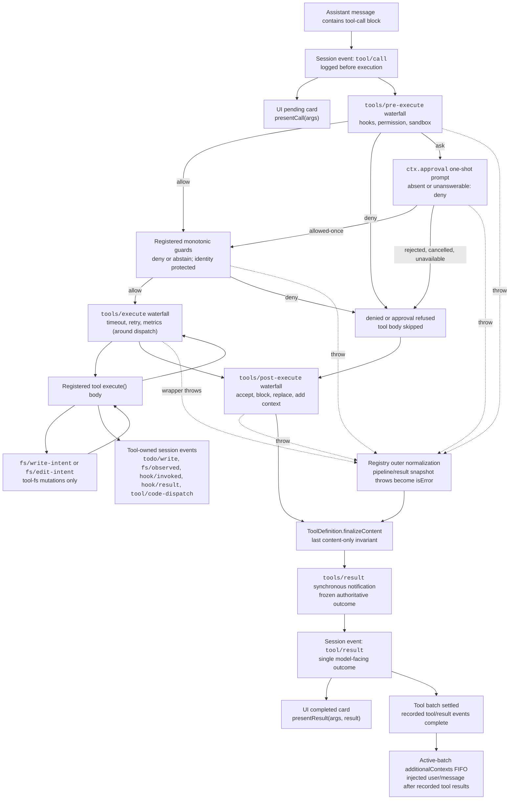

<!-- 由 scripts/gen-doc-graphs.ts 生成——请勿手工编辑。
     运行 `pnpm run gen-doc-graphs` 重新生成。 -->

# 工具执行流水线

此图展示策略、钩子、沙箱、文件系统守卫、结果重写、最终结果观察和 UI 渲染在不改变循环的情况下何时运行。`tools/pre-execute` waterfall（瀑布式事件）首先运行，随后是单调守卫，然后运行 `tools/execute` 和 `tools/post-execute` waterfall；这三个 waterfall 可以改写一次调用。由定义自身控制的 `finalizeContent` 和 `tools/result` 在此之后运行。

文件系统的先读后编辑检查在 `fs/*` 事件上位于 `tool-fs` 之下。通用 pre/post waterfall 承载钩子与审批策略；`ctx.approval` 在单调守卫之前解析询问，而不可重排的所有者策略仍是注册守卫。超时等环绕分发关注点包裹 `tools/execute`。注册表无损快照候选结果，并在可见定义快照后的 `finalizeContent` 回调强制执行其同步的仅内容不变量之前规范化快照失败。随后 `tools/result` 观察不可变的、无损 JSON 结果。这让钩子跨工具族而不把工具耦合到某个策略服务。PTC 模式把保留的 `run_code` 传输及其序列化子调用都送入流水线；子调用携带父 token、记录 `tool/code-dispatch`、把拒绝作为绑定拒绝返回，并省略 `additionalContexts` 以保持调用/结果相邻。

维护模式：人工维护的 Mermaid 流程图，由生成器写出；确切的工具 schema 与事件签名位于生成的目录中。。
